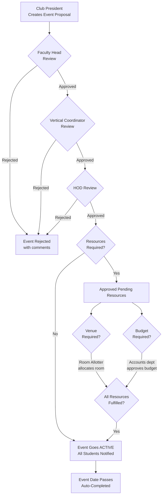

<div align="center">

# 🎓Campus Club Management Platform

**A full-stack web application that digitizes the entire lifecycle of college club event management — from proposal creation to multi-tier approval, resource allocation, and real-time notifications.**

[](https://react.dev/)
[](https://expressjs.com/)
[](https://www.mongodb.com/)
[](https://tailwindcss.com/)
[](https://threejs.org/)

</div>

---

## 📌 Problem Statement

In most colleges, the process of organizing a club event is **manual, fragmented, and time-consuming**. A Club President typically needs to:

1. Draft a proposal on paper
2. Get signatures from the Faculty Head, Vertical Coordinator, and HOD — one by one
3. Request a venue from a separate department
4. Get a budget sanctioned from the Accounts office
5. Manually inform students about the event

**Campus Club Connect eliminates this bottleneck** by providing a single, unified platform where every stakeholder — from Club President to HOD — has a role-specific dashboard to manage their part of the workflow digitally.

---

## ✨ Key Features

### 🔐 Role-Based Access Control (RBAC)
- **8 distinct user roles**, each with a tailored dashboard and permissions:
  - `SuperAdmin` · `ClubPresident` · `FacultyHead` · `VC` (Vertical Coordinator) · `HOD` · `RoomAllotter` · `Accounts` · `Student`
- JWT-based authentication stored in **httpOnly cookies** for security
- Middleware-level role authorization on every protected API route

### 📝 Event Proposal & Multi-Tier Approval Workflow
- Club Presidents create event proposals with **poster image uploads** (via Cloudinary), descriptions, dates, and optional resource requests
- Events flow through a **3-stage hierarchical approval chain**:

```
Club President ──→ Faculty Head ──→ Vertical Coordinator (VC) ──→ HOD
                       ✓/✗                 ✓/✗                    ✓/✗
```

- Each approver can **approve** (advances to next stage) or **reject with comments** (terminates the proposal)
- Full audit trail with timestamps and approver identity at each stage

### 🏛️ Resource Management
- **Venue Allocation**: Room Allotter assigns rooms to approved events
- **Budget Approval**: Accounts department reviews and sanctions budget requests
- Events auto-activate only when **all required resources are fulfilled**

### 🔔 Real-Time Notification System
- Automatic notifications pushed to users on key actions:
  - President notified on each approval/rejection
  - All students notified when an event goes **Active**
- Navbar notification bell with **unread badge**, mark-as-read, and delete functionality
- Auto-polling every 60 seconds for new notifications

### 📊 HOD Analytics Dashboard
- Department-level analytics powered by **MongoDB Aggregation Pipeline**:
  - **KPI Cards**: Total events, total clubs, pending approvals
  - **Bar Chart**: Events per club (via Chart.js)
  - **Pie Chart**: Event status distribution across the department

### ⚙️ SuperAdmin Panel
- Full CRUD operations for **Users** and **Clubs** with pagination
- Assign Club Presidents and Faculty Heads to clubs
- Automatic bi-directional linking (club ↔ user assignment)
- Clean un-assignment logic when reassigning roles

### 🚀 Immersive Landing Page
- **Three.js** powered particle background with animated "firefly" orbs
- Glassmorphism UI overlay with gradient text animations
- Responsive design with smooth hover interactions

### ⏱️ Auto-Expiry System
- Events whose date has passed are **automatically marked as Completed**
- Expiry check runs on every event fetch to keep data current

---

## 🏗️ Architecture

```
┌─────────────────────────────────────────────────────────────────┐
│                        FRONTEND (React 19 + Vite 7)            │
│  ┌──────────┐  ┌──────────┐  ┌──────────┐  ┌───────────────┐  │
│  │ Auth     │  │ Role-    │  │ API      │  │ Three.js      │  │
│  │ Context  │  │ Based    │  │ Service  │  │ Particle      │  │
│  │          │  │ Routing  │  │ Layer    │  │ Background    │  │
│  └──────────┘  └──────────┘  └──────────┘  └───────────────┘  │
│                         |  Axios (proxy)                       │
├─────────────────────────┼─────────────────────────────────────-┤
│                         ▼                                      │
│                    BACKEND (Express 5)                          │
│  ┌──────────┐  ┌──────────┐  ┌──────────┐  ┌───────────────┐  │
│  │ Auth     │  │ RBAC     │  │ Multer   │  │ Cloudinary    │  │
│  │ (JWT +   │  │ Middleware│  │ Upload   │  │ Image         │  │
│  │ Cookies) │  │          │  │          │  │ Storage       │  │
│  └──────────┘  └──────────┘  └──────────┘  └───────────────┘  │
│                         |                                      │
│                         ▼                                      │
│              ┌─────────────────────┐                           │
│              │   MongoDB (Mongoose)│                           │
│              │  Users · Clubs      │                           │
│              │  Events · Notifs    │                           │
│              └─────────────────────┘                           │
└─────────────────────────────────────────────────────────────────┘
```

---

## 🛠️ Tech Stack

| Layer        | Technology                                                            |
|:-------------|:----------------------------------------------------------------------|
| **Frontend** | React 19, Vite 7, Tailwind CSS 4, React Router 7, Axios              |
| **3D / Charts** | Three.js 0.182, Chart.js 4, react-chartjs-2                      |
| **Backend**  | Node.js, Express 5, Mongoose 8                                       |
| **Auth**     | JWT (jsonwebtoken), bcryptjs, httpOnly Cookies                        |
| **Storage**  | Cloudinary (image uploads via Multer memory storage)                  |
| **Database** | MongoDB Atlas                                                         |

---

## 📂 Project Structure

```
CampusClubConnect/
├── backend/
│   ├── config/
│   │   ├── db.js                  # MongoDB connection
│   │   └── cloudinary.js          # Cloudinary configuration
│   ├── controllers/
│   │   ├── userController.js      # Register, Login, Logout, Profile
│   │   ├── eventController.js     # CRUD, Approval chain, Resource mgmt
│   │   ├── adminController.js     # User & Club CRUD (SuperAdmin)
│   │   ├── analyticsController.js # HOD analytics aggregations
│   │   └── notificationController.js
│   ├── middlewares/
│   │   ├── authMiddleware.js      # JWT verify + role-based authorize()
│   │   └── uploadMiddleware.js    # Multer memory storage (5MB limit)
│   ├── models/
│   │   ├── userModel.js           # 8 roles, department, club assignment
│   │   ├── eventModel.js          # Approval chain + resource requests
│   │   ├── clubModel.js           # Club ↔ President/Faculty linking
│   │   └── notificationModel.js
│   ├── routes/
│   │   ├── userRoutes.js
│   │   ├── eventRoutes.js
│   │   ├── adminRoutes.js
│   │   ├── analyticsRoutes.js
│   │   └── notificationRoutes.js
│   ├── scripts/
│   │   └── seeder.js              # Database seeder with sample data
│   └── server.js                  # Express app entry point
│
├── frontend/
│   ├── src/
│   │   ├── api/                   # Axios service layer
│   │   │   ├── authService.js
│   │   │   ├── eventService.js
│   │   │   ├── adminService.js
│   │   │   └── notificationService.js
│   │   ├── components/
│   │   │   ├── Navbar.jsx         # Notification bell + user greeting
│   │   │   ├── ParticleBackground.jsx  # Three.js firefly particles
│   │   │   ├── PrivateRoute.jsx   # Auth gate
│   │   │   ├── RoleBasedRoute.jsx # Role gate
│   │   │   ├── AdminLayout.jsx    # Admin panel sidebar layout
│   │   │   ├── UserModal.jsx      # Create/Edit user form modal
│   │   │   ├── ClubModal.jsx      # Create/Edit club form modal
│   │   │   ├── ConfirmationModal.jsx
│   │   │   └── EventCard.jsx
│   │   ├── context/
│   │   │   └── AuthContext.jsx    # Global auth state + login/logout
│   │   ├── pages/
│   │   │   ├── HomePage.jsx       # Landing page with 3D background
│   │   │   ├── LoginPage.jsx
│   │   │   ├── RegisterPage.jsx
│   │   │   ├── StudentDashboardPage.jsx
│   │   │   ├── PresidentDashboardPage.jsx
│   │   │   ├── ApproverDashboardPage.jsx
│   │   │   ├── CreateEventPage.jsx
│   │   │   ├── EventDetailsPage.jsx
│   │   │   ├── HodAnalyticsPage.jsx
│   │   │   ├── UnauthorizedPage.jsx
│   │   │   └── admin/
│   │   │       ├── AdminDashboardPage.jsx
│   │   │       ├── UserListPage.jsx
│   │   │       └── ClubListPage.jsx
│   │   ├── App.jsx                # Route definitions + smart redirect
│   │   └── main.jsx
│   └── vite.config.js             # Dev proxy to backend
│
├── .gitignore
└── README.md
```

---

## 🔄 Event Approval Workflow



---

## 🗃️ Database Schema

### User
| Field           | Type     | Description                                |
|:----------------|:---------|:-------------------------------------------|
| `name`          | String   | Full name                                  |
| `email`         | String   | Unique email address                       |
| `password`      | String   | bcrypt hashed password                     |
| `role`          | Enum     | One of 8 roles (Student, ClubPresident, etc.) |
| `department`    | String   | Department affiliation                     |
| `assignedClubId`| ObjectId | Reference to assigned Club                 |

### Event
| Field           | Type     | Description                                |
|:----------------|:---------|:-------------------------------------------|
| `title`         | String   | Event name                                 |
| `description`   | String   | Detailed description                       |
| `posterImageUrl` | String  | Cloudinary hosted poster URL               |
| `eventDate`     | Date     | Scheduled date                             |
| `overallStatus` | Enum     | Tracks position in approval pipeline       |
| `approvalChain` | Object   | Nested status for FacultyHead, VC, HOD     |
| `resourceRequests` | Object | Venue and budget request status/details  |
| `createdBy`     | ObjectId | Club President who proposed it             |
| `clubId`        | ObjectId | Originating club                           |

### Club
| Field           | Type     | Description                                |
|:----------------|:---------|:-------------------------------------------|
| `name`          | String   | Club name (unique)                         |
| `department`    | String   | Parent department                          |
| `presidentId`   | ObjectId | Assigned Club President                    |
| `facultyHeadId` | ObjectId | Assigned Faculty Advisor                   |

---

## 🚀 Getting Started

### Prerequisites
- **Node.js** v18+
- **MongoDB** (Atlas or local instance)
- **Cloudinary** account (free tier works)

### 1. Clone the Repository

```bash
git clone https://github.com/Bhushan144/campus-club-connect.git
cd campus-club-connect
```

### 2. Backend Setup

```bash
cd backend
npm install
```

Create a `.env` file in the `backend/` directory:

```env
PORT=5001
MONGODB_URI=your_mongodb_connection_string
DB_NAME=clubsphere
JWT_SECRET=your_jwt_secret_key
NODE_ENV=development
FRONTEND_URL=http://localhost:5173

CLOUDINARY_CLOUD_NAME=your_cloud_name
CLOUDINARY_API_KEY=your_api_key
CLOUDINARY_API_SECRET=your_api_secret
```

### 3. Seed the Database (Optional)

Populate sample users across all 8 roles and a demo club:

```bash
npm run data:import     # Seed data
npm run data:destroy    # Clear all data
```

<details>
<summary>📋 Seeded Test Accounts (all passwords: <code>password123</code>)</summary>

| Role            | Email                          |
|:----------------|:-------------------------------|
| SuperAdmin      | `admin@college.edu`            |
| ClubPresident   | `priya.sharma@college.edu`     |
| FacultyHead     | `rajesh.kumar@college.edu`     |
| VC              | `anjali.mehta@college.edu`     |
| HOD             | `vikram.singh@college.edu`     |
| Accounts        | `sunita.rao@college.edu`       |
| RoomAllotter    | `amit.desai@college.edu`       |

</details>

### 4. Frontend Setup

```bash
cd ../frontend
npm install
```

### 5. Run the Application

**Terminal 1 — Backend:**
```bash
cd backend
npm run server     # Starts with nodemon on port 5001
```

**Terminal 2 — Frontend:**
```bash
cd frontend
npm run dev        # Starts Vite dev server on port 5173
```

Open your browser at **http://localhost:5173**

---

## 📡 API Reference

### Authentication
| Method | Endpoint              | Access  | Description          |
|:-------|:----------------------|:--------|:---------------------|
| POST   | `/api/users/register` | Public  | Register new user    |
| POST   | `/api/users/login`    | Public  | Authenticate user    |
| POST   | `/api/users/logout`   | Private | Clear JWT cookie     |
| GET    | `/api/users/profile`  | Private | Get logged-in user   |

### Events
| Method | Endpoint                         | Access                    | Description               |
|:-------|:---------------------------------|:--------------------------|:--------------------------|
| GET    | `/api/events`                    | Private (role-filtered)   | Get events for user role  |
| POST   | `/api/events`                    | ClubPresident             | Create event proposal     |
| GET    | `/api/events/:id`                | Private                   | Get event details         |
| DELETE | `/api/events/:id`                | ClubPresident / SuperAdmin| Delete an event           |
| PATCH  | `/api/events/:id/approve`        | FacultyHead / VC / HOD    | Approve event             |
| PATCH  | `/api/events/:id/reject`         | FacultyHead / VC / HOD    | Reject with comments      |
| PATCH  | `/api/events/:id/allocate-venue` | RoomAllotter              | Assign room to event      |
| PATCH  | `/api/events/:id/approve-budget` | Accounts                  | Approve budget request    |

### Admin (SuperAdmin only)
| Method | Endpoint               | Description                |
|:-------|:-----------------------|:---------------------------|
| GET    | `/api/admin/users`     | List users (paginated)     |
| GET    | `/api/admin/users/all` | List all users (no pagination) |
| POST   | `/api/admin/users`     | Create user                |
| PUT    | `/api/admin/users/:id` | Update user                |
| DELETE | `/api/admin/users/:id` | Delete user                |
| GET    | `/api/admin/clubs`     | List all clubs             |
| POST   | `/api/admin/clubs`     | Create club                |
| PUT    | `/api/admin/clubs/:id` | Update club                |
| DELETE | `/api/admin/clubs/:id` | Delete club                |

### Notifications
| Method | Endpoint                          | Access  | Description              |
|:-------|:----------------------------------|:--------|:-------------------------|
| GET    | `/api/notifications`              | Private | Get my notifications     |
| PATCH  | `/api/notifications/:id/read`     | Private | Mark as read             |
| DELETE | `/api/notifications/:id`          | Private | Delete notification      |

### Analytics
| Method | Endpoint               | Access | Description              |
|:-------|:-----------------------|:-------|:-------------------------|
| GET    | `/api/analytics/hod`   | HOD    | Department-level analytics |

---

## 🧠 Technical Highlights

- **Approval Chain as Embedded Document**: The `approvalChain` field in the Event model uses nested subdocuments to track each level's status, approver, timestamp, and comments — avoiding extra collections and enabling atomic updates.

- **Auto-Activation Logic**: After HOD approval or resource allocation, a helper function (`checkAndActivateEvent`) checks if all requirements are met before transitioning the event to Active status — implemented as a reusable server-side function.

- **Cookie-Based Auth over Header Tokens**: Using httpOnly cookies with `sameSite: strict` provides built-in CSRF protection and prevents XSS from stealing tokens, unlike localStorage-based approaches.

- **Vite Dev Proxy**: The frontend's `vite.config.js` proxies `/api` requests to the backend, enabling same-origin development without CORS issues.

- **Three.js Particle System**: The landing page renders 200 animated particles using additive blending and radial gradient textures — all generated procedurally via Canvas API (no texture files needed).

---

## 📄 License

This project is open source and available under the [ISC License](https://opensource.org/licenses/ISC).

---

<div align="center">

**Built with ❤️ by [Bhushan](https://github.com/Bhushan144)**

</div>

